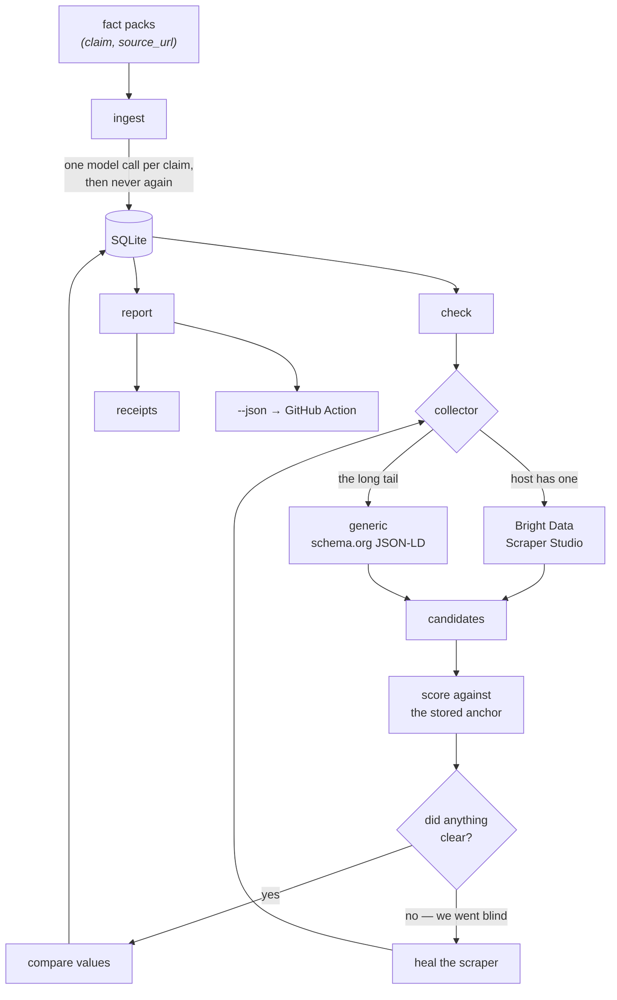

# Architecture

How claimrot is put together, and why the pieces are split where they are.

If you only read one thing, read [The decision](#the-decision) — everything else
exists to serve it.

## The shape of it



## The decision

Everything hinges on separating two things that look identical from the outside:

- **the value changed** — that is a finding
- **we can no longer see the value** — that is a statement about our own eyesight

A checker that conflates them reports every site redesign as *"the operator
deleted this."* Its negatives become worthless, and within a fortnight nobody
reads its alerts.

So finding nothing never produces a verdict. It produces a repair attempt, and
only a *working* scraper that still finds nothing may say `REMOVED`.

| Extraction | Comparison | Verdict |
| --- | --- | --- |
| clean | matches | `HOLDS` |
| clean | differs | `DRIFTED` |
| clean | two readings, both defensible | `AMBIGUOUS` |
| nothing | — | heal, then re-run |
| nothing after a heal, but the anchor resolves on a successor page | matches | `MOVED` |
| nothing after a heal, but the anchor resolves on a successor page | differs | `DRIFTED` |
| nothing after a heal, and nowhere else on the host | — | `REMOVED` |
| heal failed or is awaiting approval | — | `UNVERIFIABLE` |

`src/engine/check.ts` is the only file allowed to reach those last three. A test
sweeps every combination of extraction failure and heal outcome and asserts that
none of them can produce `DRIFTED`.

## Moved, not deleted

A value that vanished from the page it was cited on has not necessarily gone
anywhere — operators split pricing onto its own page all the time. Reporting
that as `REMOVED` is the same class of error as reporting a redesign as a
deletion, one level up.

So before `REMOVED`, `src/collect/successor.ts` proposes successor pages from
signals the **site itself** publishes: links on the cited page first, then the
host's `sitemap.xml` only if those yield nothing. Each candidate is then
verified by a real collector run and scored against the same anchor as every
other verdict. Discovery decides where to look; scoring still decides what is
true.

Three properties make this safe rather than a crawler:

- **Same host, always**, and robots-checked per successor, not just for the
  cited page. A cross-host successor would escape both the permission we hold
  and the queue we are standing in.
- **Paced request by request.** `HostQueue` spaces queue *slots*, not the
  requests inside one — and relocation adds several. Each is held behind an
  explicit `MIN_HOST_INTERVAL_MS` wait, so a relocation cannot burst ten
  requests at a host behind one slot's spacing. A test asserts the strict
  alternation of wait and fetch, because this is exactly the kind of guarantee
  that rots silently.
- **Bounded.** At most `MAX_SUCCESSORS` (5) pages are tried, and anything
  dropped by that cap is logged — a capped search must never read as an
  exhaustive one.
- **Not a value search.** A candidate page carrying the right number under the
  wrong label is rejected, exactly as it would be on the original page.

`MOVED` means the prose is still true and the citation is stale; the receipt
carries `foundAt`, which is the URL to change it to. If the relocated value
*also* differs, the verdict stays `DRIFTED` — a false claim is the more serious
finding — and `foundAt` records the move alongside it.

## Anchors, not values

An assertion does not store *"175"*. It stores *"whatever sits beside the label
**Adult**, in the section **Ocean Cabin**"*.

The difference matters because of a real case: an operator's NZ$59 was the adult
fare and later became the senior fare. The number is still on the page. A checker
that searches for `59` finds it and reports the claim healthy indefinitely. A
checker that searches for `Adult` reads `65` and catches it immediately.

`src/resolve/score.ts` therefore never reads a candidate's value. It scores only
how well the candidate's *label and context* match the recorded anchor, and a
test asserts that two candidates differing only in value score identically.

## Modules

| Path | Job |
| --- | --- |
| `src/ingest/` | Read fact packs; reduce prose to assertions (the only model call) |
| `src/collect/` | Run collectors, map their output to candidates, screen blobs |
| `src/resolve/` | Score candidates against an anchor; turn them into a verdict |
| `src/engine/` | The three-branch decision, and when to check next |
| `src/report/` | Receipts for humans, JSON for CI |
| `src/net/` | Per-host rate limiting and robots.txt |
| `src/db/` | Schema, row mappers, shared statements |
| `action/` | The GitHub Action that fails a pull request |

Dependencies point one way: `resolve` never learns about collectors, `engine`
depends only on `resolve` and the shared types, `report` only touches the
database.

## Why the model is called once

Reducing *"Ocean Cabin is NZ$175 per adult"* into something testable needs
language understanding. Comparing `175` to `175` does not.

So the model runs once per claim at ingest and produces a structured assertion.
Every check afterwards is a fetch and a numeric comparison — no model call, no
per-check inference cost. That is what makes monitoring thousands of claims on a
schedule affordable rather than theoretical.

## Storage

One SQLite file.

```
documents ──< claims ──< assertions
                 │
                 └──< verdicts   (verdict, confidence, evidence_json)
```

Two timestamps on `claims` do different jobs and must not be merged:

- **`checked_at`** — when the *source* was last verified by whoever wrote the
  claim. Immutable after ingest. The half-life study measures against it.
- **`last_checked_at`** — when claimrot last looked. The scheduler owns it.

Collapsing these into one column makes every claim appear zero days old the
moment you run a check, which silently flattens the decay study to nothing.

## Being a good citizen

Third parties bear the cost of a monitor that runs on a schedule, so:

- one request in flight per host, roughly 0.8 per second, parallel *across* hosts
  only
- `robots.txt` fetched once per host through the same queue, wildcard group,
  longest-match `Allow`
- an identifying User-Agent with a contact URL on every direct request
- a disallowed URL produces **no verdict at all** rather than a fabricated one

The rate limit is not decoration. An earlier project put 375 concurrent probes on
a partner's production host and took it down for ninety minutes.

## Things that are specified but not wired

Written down so nobody has to discover them by reading source:

- `anchor_path` is never populated, so the DOM-path signal in scoring cannot
  fire. Scores renormalise over the signals that do exist.
- `expires_at` is never populated, so the expiry-aware scheduling — check the day
  before *and* the day after a self-declared expiry — is implemented, tested, and
  unreachable in production.
- The `checks` and `candidates` tables are created and never written. Evidence
  lives inline in `verdicts.evidence_json`.
